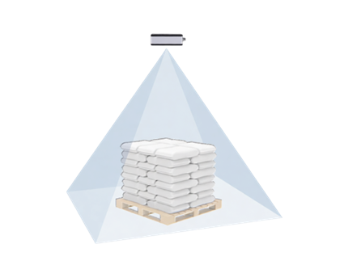
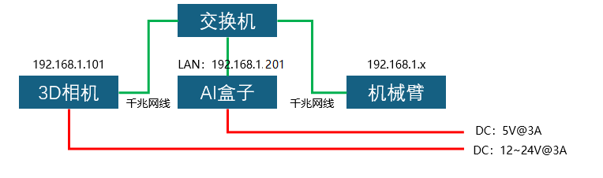
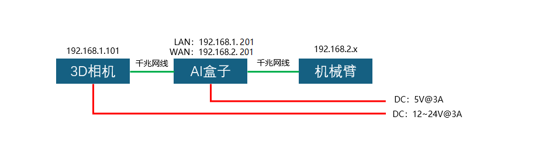

## 1.1 硬件清单

| 序号 | 名称       |
| ---- | ---------- |
| 1    | 3D相机     |
| 2    | AI盒子主机 |
| 3    | 电源5V/3A  |
| 4    | 网线       |
| 5    | 显示器     |
| 6    | 键盘鼠标   |

## 1.2 环境安装

根据垛的尺寸（长、宽、高），将3D相机安装到合适的高度。

| 名称     | 参数                 |
| -------- | -------------------- |
| 工作距离 | 1 - 5米              |
| 视场角   | 67°(H)*50°(V)        |
| 近端视场 | 1.32 * 0.93 米 @ 1米 |
| 远端视场 | 6.62 * 4.66 米 @ 5米 |

## 1.3 安装原则

- 支持眼在手外/手上及其多种垛位方式。

| 手眼方式 | 单垛位 | 双垛位 |
| :------: | :----: | :----: |
| 眼在手上 |  支持  |  支持  |
| 眼在手外 |  支持  |  支持  |

- 3D相机需要安装在检测垛的正上方，并且垛中心位于图像的正中心。

- 垛的最高与最低处的长宽，都要满足视场覆盖范围。

- 在符合覆盖范围的前提下，垛越靠近相机，检测精度越高。

## 1.4 线缆连接

本AI视觉拆垛系统，包含3D相机与AI盒子两部分，需要分别连接网线与电源线。

连接方式有两种，分别如下图。推荐使用**连接方式二**。

连接方式一：

**LAN口<------------------------->交换机**

**3D相机<-------------------------->交换机**

**机械臂<-------------------------->交换机**

**AI盒子，3D相机，机械臂在同一子网段内。**

连接方式二：

**AI盒子 WAN口<------------------------->机械臂**

**AI盒子 LAN口<-------------------------->3D相机**

## 1.5 默认IP地址

| 设备        | IP地址        |
| ----------- | ------------- |
| 3D相机      | 192.168.1.101 |
| AI盒子WAN口 | 192.168.2.201 |
| AI盒子LAN口 | 192.168.1.201 |
