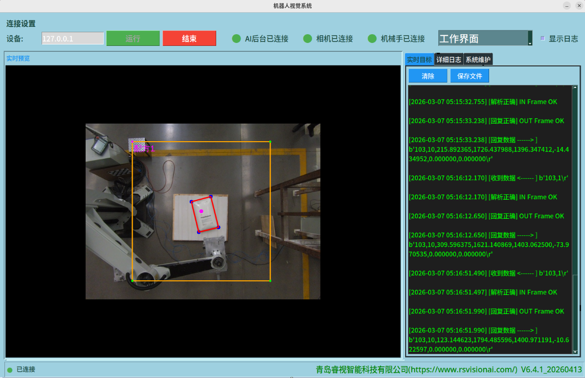
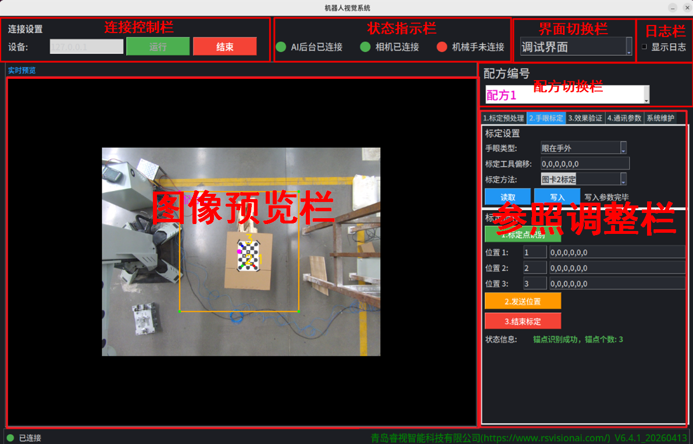
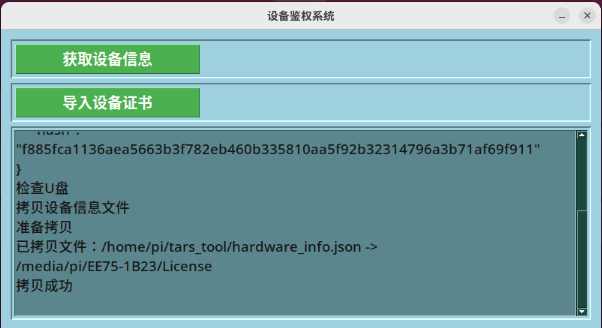
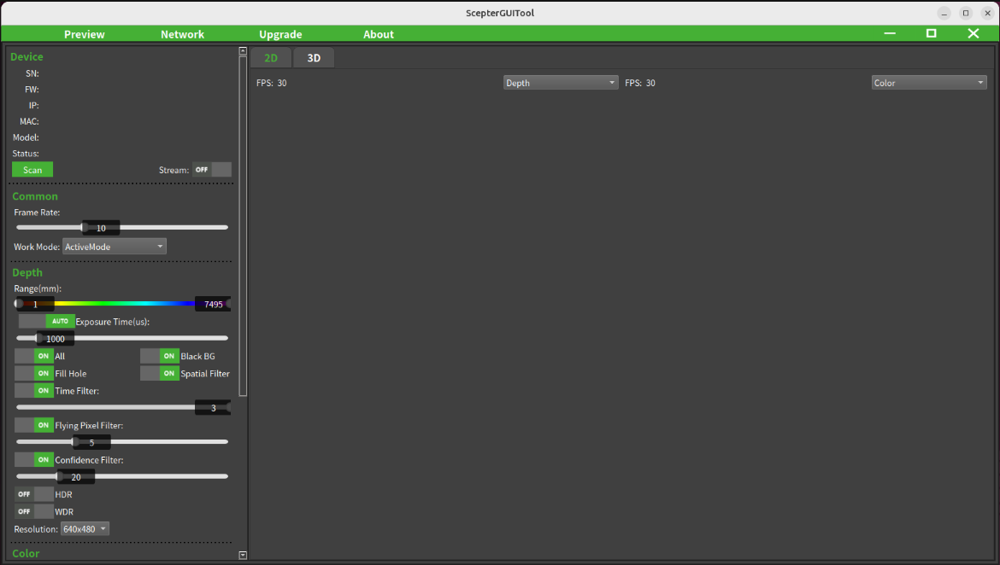
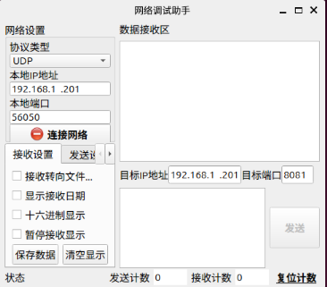

## 2.1 系统软件构成

TARS智能视觉系统，包含4个软件：

| 软件名称     | 说明                                                         |
| ------------ | ------------------------------------------------------------ |
| TARS拆垛     | TARS智能视觉拆垛主软件，负责读取3D相机图像，进行目标识别，手眼转换，并将结果发送给机械臂。 |
| TARS鉴权     | TARS智能视觉鉴权软件，负责TARS拆垛主软件的授权。             |
| 3D相机采图   | 3D相机的采图工具，用于采集图像，查看3D环境和评估图像质量。   |
| 网络调试助手 | 网络调试助手，用来测试网络通路是否正常。                     |

## 2.2 TARS拆垛 

TARS智能视觉系统主软件，该软件主要具备配方切换、标定预处理、手眼标定、效果验证和通讯参数等功能。后续章节，均以此软件为基础，描述其功能操作说明。

该软件支持2个操作界面：工作界面，调试界面。软件默认启动**工作界面**。

### 2.2.1 工作界面

在该界面，可实时查看机械臂通信、命令内容、以及识别状况。

1. 点击”**运行**“，成功后，实时预览实时显示当前画面
2. 在右侧状态栏，看到机械臂发送的命令内容与时间；左侧画面栏，识别成功的目标会实时绘制在预览画面。

### 2.2.2 调试界面

切换到**调试界面**后，页面布局如下:

- 连接控制栏： 用于控制后台算法的连接
- 状态指示栏：用于指示系统子模块的运行状态和网络连接状态
- 界面切换栏：用于切换不同运行界面
- 日志栏： 可查看UI软件运行日志
- 图像预览栏：用于实时查看当前画面
- 配方切换栏：用于切换不同配方进行参数设置
- 参数调整栏：用于进行参数调整，相机标定等

### 2.2.3 配方切换

当前AI视觉拆垛系统支持3个配方，分别为：配方1，配方2，配方3。每种配方可以单独设置工程参数，手眼标定，效果验证等功能。不同的配方之间，标定参数，ROI区域参数是独立互不干扰的。

## 2.3 TARS鉴权

TARS智能视觉系统鉴权工具软件，主要作为对Tars Tool软件激活管理工作。操作时，使用U盘作为激活文件的媒介。

| 序号 | 功能         | 说明                                                         |
| ---- | ------------ | ------------------------------------------------------------ |
| 1    | 获取设备信息 | 生成设备信息文件，并将文件拷贝到U盘根目录的license文件夹     |
| 2    | 导入设备证书 | 将U盘根目录下的license文件夹的设备证书文件，拷贝指定目录。完成激活操作。 |

## 2.4 3D相机采图

3D相机采图工具，主要作为调整3D相机的曝光时间，帧率等参数和3D相机固件升级的工具。

## 2.5 网络调试助手

开源的网络助手工具。用来测试网络通讯是否正常。

