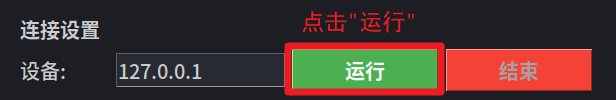
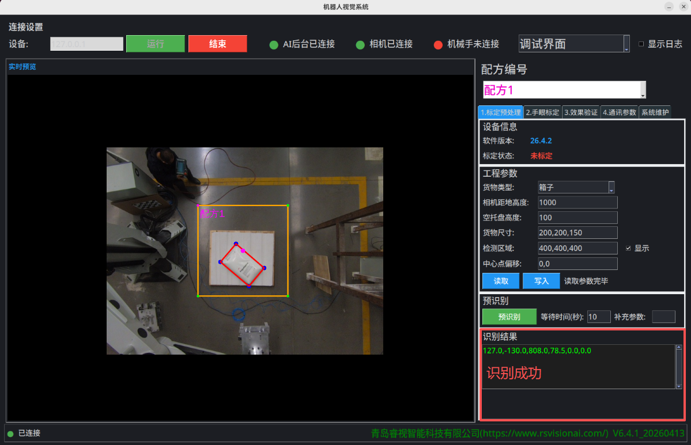
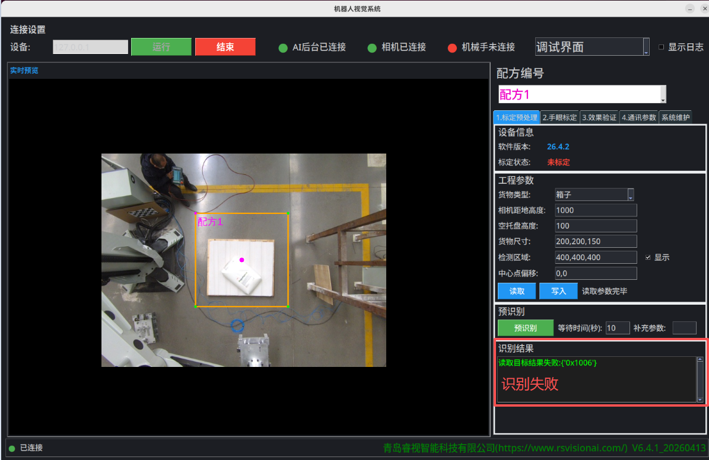
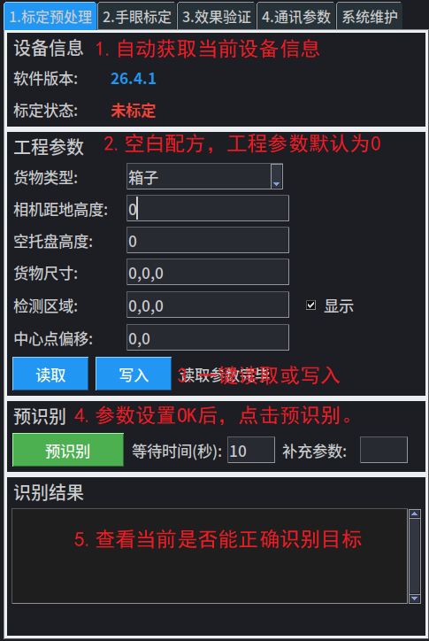

在手眼标定前，可初步的进行目标预识别验证。视觉系统中已经集成纸箱与软包的超级模型，可以适应常见的各类纸箱与软包，如果识别效果不佳，或者识别目标特殊，可以进行数据采集后交给业务进行模型微调。

## 3.1 目标预识别

打开配置软件，按照如下步骤操作：

1. 连接设备：切换运行界面到“**调试界面**”，点击"**运行**"按钮。成功后，实时显示预览图像。**默认读取“配方01”的参数**。

2. 选择检测类型：箱子/软包

3. **根据实际，填写相机高度，托盘高度，货物尺寸，检测区域，区域偏移等参数**。当区域设置OK后，图像预览会自动显示ROI框。

4. 预识别：点击“**预识别**”按钮，查看识别结果。识别成功，识别结果会显示目标坐标，同时绘制在预览图中。识别失败时，识别结果会打印"读取目标结果失败：{'0x1006'}"。

   **识别成功：**

​	 **识别失败：**

2. 更改目标位置以及高度，重复2，3步骤，确认检测效果。

