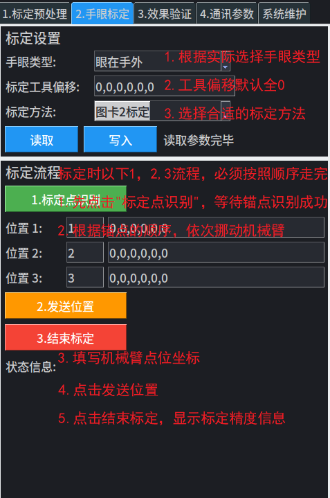
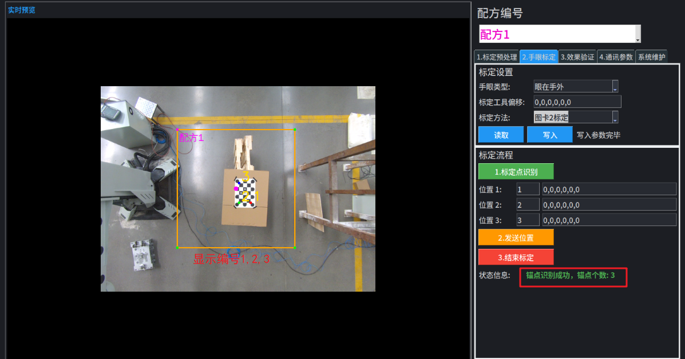
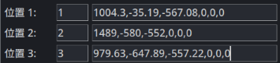
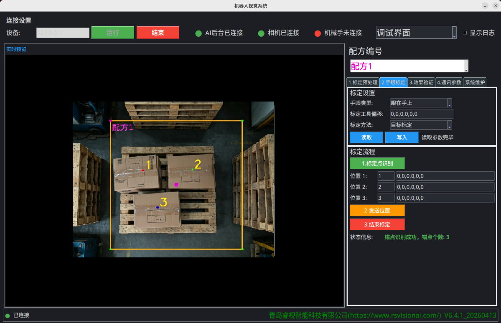
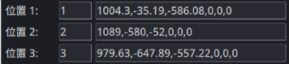

## 4.1 手眼标定

完成预处理识别及其设置完ROI等参数后，开始进行与机械臂的手眼标定。

AI视觉系统，支持2类标定方法，图卡标定和目标标定。

| 标定方法 |         精度等级          |
| :------: | :-----------------------: |
| 图卡标定 | 毫米级精度，典型值：±2mm  |
| 目标标定 | 厘米级精度，典型值：±20mm |

## 4.2 图卡标定

- 将图卡放在工作区域范围内，通过预览图确认摆放位置。建议图卡距离相机1~3m。

- 按照需求设置手眼类型等参数。**选择图卡标定**。

- 点击“**标定点识别**”。正确识别锚点后，图卡对应位置会被正确标记（显示编号1,2,3）。

- 如3个角点已经可以被正确识别，则可开始依次移动机械臂到1号，2号，3号点，记录输入机械臂的直角坐标系坐标到对应位置，并输入到3个位置里。

- 点击“发送位置”，等待标定结果。下方的**状态信息**，可实时查看标定状态。

- 点击“**结束标定**”。

## 4.3 目标标定

- 将目标放在工作区域范围内，通过预览图确认摆放位置。建议目标距离相机1~3m。

- 按照需求设置手眼类型等参数。**选择目标标定**。

- 点击“**标定点识别**”，如正确识别目标被正确标记（显示编号1,2,3）。

- 如3个目标已经可以被正确识别，则可开始依次移动机械臂到1号，2号，3号目标，记录输入机械臂的直角坐标系坐标到对应位置，并输入到3个位置里。

- 点击“发送位置”，等待标定结果。下方的**状态信息**，可实时查看标定状态。

- 点击“**结束标定**”。
