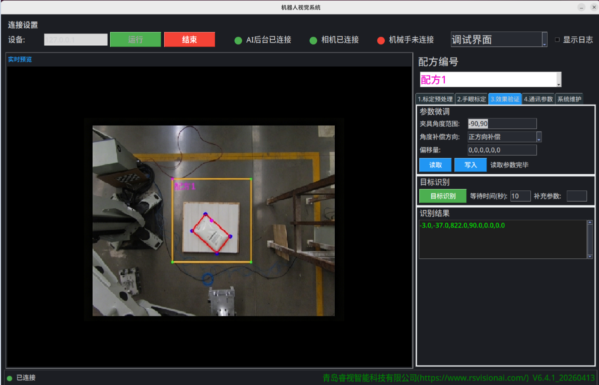
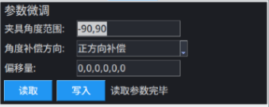

## 5.1 效果验证

1. 完成手眼标定后，将图卡移走，重新摆放测试物体。
2. 切换到“**3.效果验证**”栏
3. 点击“**目标识别**”，等待识别完成。识别成功后，会在预览图中框出目标，并将机械臂坐标系的结果输出到结果栏。
4. 手动移动机械臂，移动到输出结果位置，查看是否准确。
5. 更改微调参数，重复步骤3-4，已查找最佳抓取位置
6. 摆放物体多次进行1-5步骤的验证，以证明标定成功。

**特别说明：**

1. 如果在验证结果，多次测试，发现存在固定误差，可以通过**参数微调**中的**偏移量**进行offset补偿。

## 5.2 参数微调

