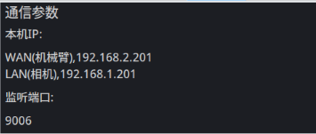
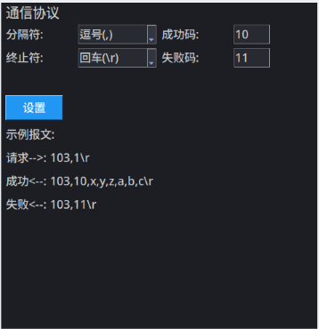

在完成手眼标定后，可以进行机械臂通信的调试。

切换界面到“**4.通讯参数**”

## 6.1 通信参数



机械臂与视觉拆垛盒子进行TCP通讯时，**盒子作为TCP server**。

根据连接方式，机械臂端侧填写视觉盒子IP地址，端口号：**9006**。


**连接方式**：

​	WAN口连接机械臂。

​	LAN口连接相机。


## 6.2 通信协议

通信协议支持定制化分隔符，终止符和返回码。




**定制化分隔符**：逗号（,)，分号(;)，空格( )

**定制化结束符符**：回车(\r)，回车换行(\r\n)，换行(\n)，

**定制化成功码/失败码**：数值范围0~65535


- **单次交互返回1个目标**

眼在手外，请求命令格式：

```asciiarmor
103,M\r
```

眼在手上，请求命令格式：

```asciiarmor
103,M,xr,yr,zr,ar,br,cr\r
```

其中，

M：为配方号码

xr,yr,zr,ar,br,cr：为机械臂末端位姿


正确返回：

```asciiarmor
103,10,x,y,z,alpha,beta,gamma\r
```

错误返回：

```asciiarmor
103,11\r
```

其中，x,y,z为机械臂坐标系下的全局坐标系坐标位置；alpha，beta，gamma为3个坐标轴的补偿角度。**（注意：alpha，beta，gamma的补偿角顺序不一定与x，y, z一致）**


- **单次交互返回N个目标**

眼在手外，请求命令格式：

```asciiarmor
105,M,N\r
```

眼在手上，请求命令格式：

```asciiarmor
105,M,N,xr,yr,zr,ar,br,cr\r
```

其中，

M：为配方号码

N：为单次交互最多返回的目标数量。实际返回目标数量<=N。

xr,yr,zr,ar,br,cr：为机械臂末端位姿


正确返回：

```asciiarmor
105,10,N,x1,y1,z1,alpha1,beta1,gamma1, ... ... ,xN,yN,zN,alphaN,betaN,gammaN\r
```

其中，

N：为返回的目标个数

x,y,z：为机械臂坐标系下的全局坐标系坐标位置；

alpha，beta，gamma：为3个坐标轴的补偿角度。**（注意：alpha，beta，gamma的补偿角顺序不一定与x，y, z一致）**


错误返回：

```asciiarmor
105,11\r
```

