## 7.1 数据采集

如遇到检测效果不佳，请使用3D相机的GUI工具进行数据采集。操作步骤：

1. 根据场景使用具体情况，摆放目标，并采集各层图像。

2. 搜索相机，连接相机，并开流。

   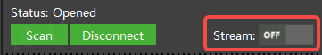

3. 点击’stream on‘，切换RGB分辨率到1600*1200

   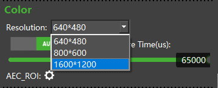

4. 点击右侧Depth图像为DepthToColorSensor

   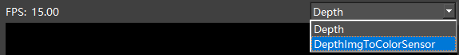

5. 在Save Image栏，点击’照相机‘按钮，即可完成一组拍照。

   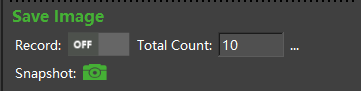

6. 根据不同摆放角度，层高，单个目标，多个目标等情况，总计采集30张图片左右即可。

### 7.1.1 数据采集规则

数据采集尽量可以模拟实际场景的全部情况，例如垛的全部层数，以及逐层去掉每个目标的图片。

如果实际情况无法完全模拟，可以通过以下参考进行数据采集。

|              说明              |                             举例                             |
| :----------------------------: | :----------------------------------------------------------: |
| 无旋转+旋转45°、无高度、单目标 | 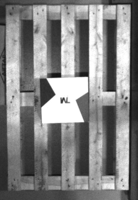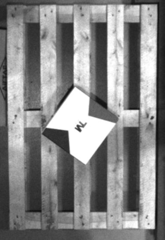 |
| 无旋转+旋转45°、无高度、单目标 | 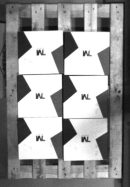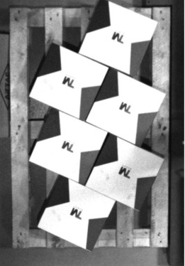 |
|    无旋转、叠放、上层单目标    | 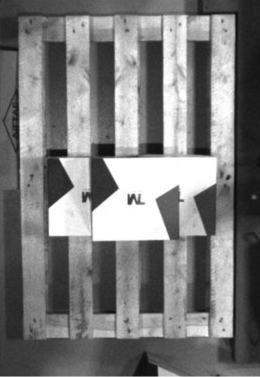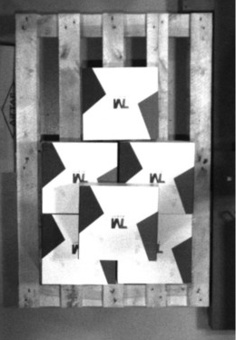 |
|  无旋转45°、叠放、上层单目标   | 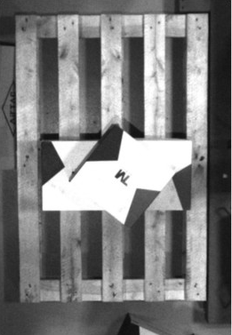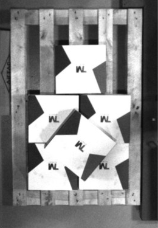 |
|          自由发挥摆放          |       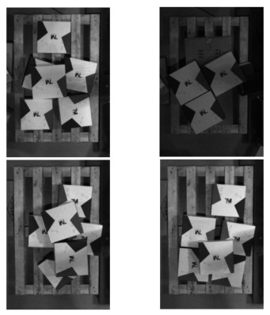        |

